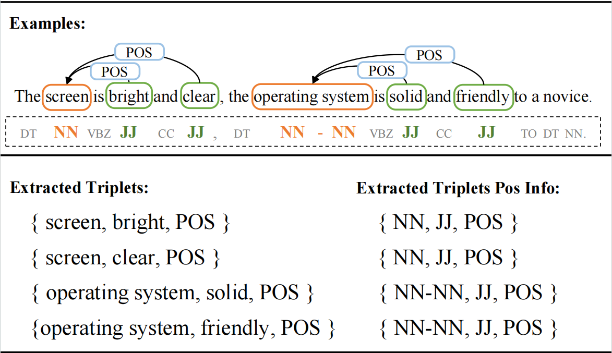
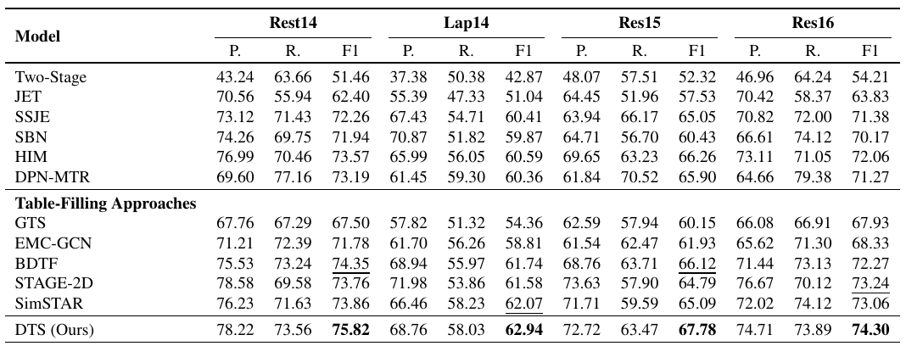
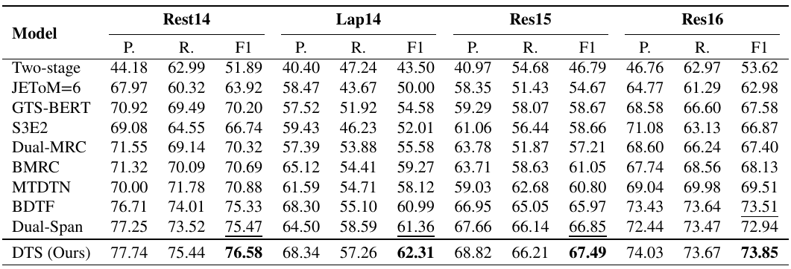

# DTS: A Decoupled Task Specificity Approach for Aspect Sentiment Triplet Extraction

## Introduction
ASTE extracts target terms, opinion terms, and their sentiment polarity from reviews. Contemporary table-filling approaches prominently construct a task-sharing table for distinct subtasks to exploit the interaction between entities. However, the single table mechanism neglects the need for task-specific knowledge, inevitably causing feature 
confusion. We introduce an innovative method named Decoupled Task Specificity (DTS) to address these issues. Specifically, this model builds a term expert table to learn semantically and syntactically enhanced knowledge for term extraction while constructing another sentiment expert table for sentiment classification by incorporating more 
comprehensive contextual knowledge. 




### Experimentual Results

The main results of ASTE-DATA-V2 are listed in the table below. The detailed analysis is available in the paper.




In addition, we evaluate our proposed model on the ASTE-DATA-V1 dataset. Its results are listed in the table below, and the detailed analysis is available in the paper.



## Configuration
All the experiments in this thesis were conducted based on the Anaconda virtual environment, and the basic hardware environment and major software versions are shown in the list:
- Anaconda Version: conda 22.9.0
- Python Version: 3.7.16
- RTX3090 (Small batch data testing is based on the NVIDIA RTX3060)
- NVIDIA Driver Version: 531.18

### Conda Configuration
In this section, we will give details on how to configure DTS's conda virtual environment and give specific installation instructions, all based on pip 23.0.1 installation, as shown below:


```sh
pip install transformers==4.15.0
pip install pytorch==1.8.0 (cu111)
pip install einops=0.4.0
pip install torchmetrics==0.7.0
pip install tntorch==1.0.1
pip install pytorch-lightning==1.3.5
pip install spacy==3.5.0
pip install nltk==3.7.0
...
```
The above gives the main packages included in the environment, and we provide a simple requirement.txt file that you can use to install them with the following statement:
```sh
pip install -r requirements.txt
```

### DTF Project Structure
Model code section:
```
mycode
   ├── utils
   ├── mymodel
   ├── train.py
   └── shell_script
    ├── aste_14res.sh
    ├── aste_14lap.sh
    ├── aste_15res.sh
    └── aste_16res.sh
```
The following is the structure of the data file:
```
data
 └── ASTE_DATASETS
        ├── V1
        │   ├── 14res
        |   │   ├── train.json
        |   │   ├── dev.json
        |   │   └── test.json
        │   ├── 14lap/...
        │   ├── 15res/...
        |   └── 16res/...
        └── V2
            ├── 14res
            |    ├── train.json
            |    ├── dev.json
            |    └── test.json
            ├── 14lap/...
            ├── 15res/...
            └── 16res/...
```

### Run The Code!

Enter `mycode` and
- execute `chmod +x shell_script/*`,
- execute `shell_script/aste_14lap.sh`.
